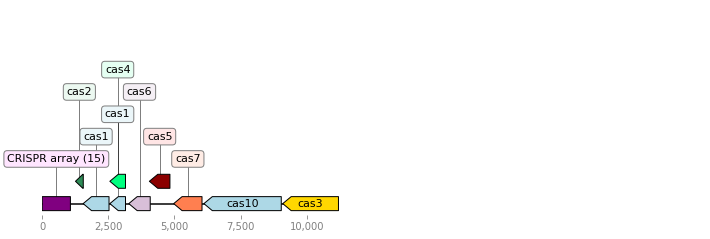
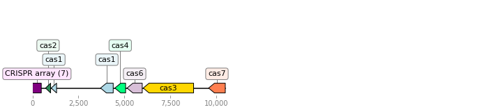
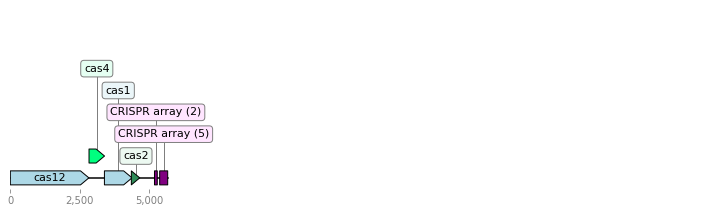
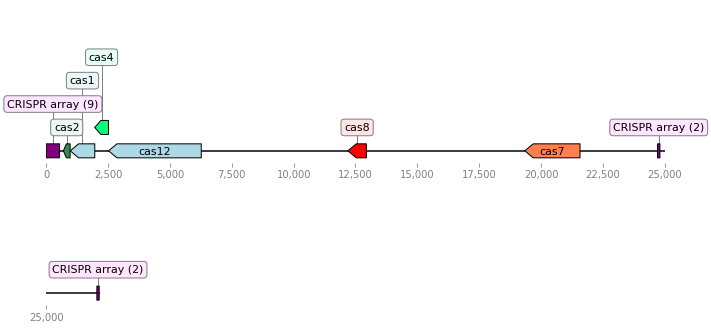

.. _example-usage:

Example Usage
=============

Example 1: Finding CRISPR-Cas systems in a cyanobacteria genome
---------------------------------------------------------------

In this example, we will annotate and visualize CRISPR-Cas systems in the cyanobacteria species Rippkaea orientalis. CRISPR-Cas is a widespread bacterial defense system, found in at least 50% of all known prokaryotic species. This system is significant in that it can be leveraged as a precision gene editing tool, an advancement that was awarded the 2020 Nobel Prize in Chemistry. The genome of R. orientalis harbors two complete CRISPR-Cas loci (one chromosomal, and one extrachromosomal/plasmid).

You can download the complete assembled genome `here <https://www.ncbi.nlm.nih.gov/assembly/GCF_000024045.1/>`_; it is also available at `<https://github.com/wilkelab/Opfi>`_ under ``tutorials``, along with the other data files necessary to run these examples, and an interactive jupyter notebook version of this tutorial. 

To run the code snippets here, Opfi must be installed, along with NCBI BLAST+ **and** PILER-CR. More detailed installation instructions can be found in the :ref:`installation` section. 

1. Use the makeblastdb utility to convert a Cas protein database to BLAST format
################################################################################

We start by converting a Cas sequence database to a format that BLAST can recognize, using the command line utility :program:`makeblastdb`, which is part of the core NCBI BLAST+ distribution. A set of ~20,000 non-redundant Cas sequences, downloaded from `Uniprot <https://www.uniprot.org/uniref/>`_ is available as a tar archive ``tutorials/cas_database.tar.gz`` . We'll make a new directory, "blastdb", and extract sequences there:

.. code-block:: bash

    mkdir blastdb
    cd blastdb && tar -xzf cas_database.tar.gz && cd ..

Next, create two BLAST databases for the sequence data: one containing Cas1 sequences only, and another that contains the remaining Cas sequences.

.. code-block:: bash

    cd blastdb && cat cas1.fasta | makeblastdb -dbtype prot -title cas1 -hash_index -out cas1_db && cd ..
    cd blastdb && cat cas[2-9].fasta cas1[0-2].fasta casphi.fasta | makeblastdb -dbtype prot -title cas_all -hash_index -out cas_all_but_1_db && cd ..

``-dbtype prot`` simply tells :program:`makeblastdb` to expect amino acid sequences. We use ``-title`` and ``-out`` to name the database (required by BLAST) and to prefix the database files, respectively. ``-hash_index`` directs :program:`makeblastdb` to generate a hash index of protein sequences, which can speed up computation time.

2. Use Gene Finder to search for CRISPR-Cas loci
################################################

CRISPR-Cas systems are extremely diverse. The most recent `classification effort <https://www.nature.com/articles/s41579-019-0299-x>`_ identifies 6 major types, and over 40 subtypes, of compositionally destinct systems. Although there is sufficent sequence similarity between subtypes to infer the existence of a common ancestor, the only protein family present in the majority of CRISPR-cas subtypes is the conserved endonuclease Cas1. For our search, we will define candidate CRISPR-cas loci as having, minimally, a cas1 gene.

First, create another directory for output:

.. code-block:: bash

    mkdir example_1_output

The following bit of code uses Opfi's :mod:`gene_finder.pipeline` module to search for CRISPR-Cas systems:

.. code-block:: Python

    from gene_finder.pipeline import Pipeline
    import os

    genomic_data = "GCF_000024045.1_ASM2404v1_genomic.fna.gz"
    output_directory = "example_1_output"

    p = Pipeline()
    p.add_seed_step(db="blastdb/cas1_db", name="cas1", e_val=0.001, blast_type="PROT", num_threads=1)
    p.add_filter_step(db="blastdb/cas_all_but_1_db", name="cas_all", e_val=0.001, blast_type="PROT", num_threads=1)
    p.add_crispr_step()

    # use the input filename as the job id
    # results will be written to the file <job id>_results.csv
    job_id = os.path.basename(genomic_data)
    results = p.run(job_id=job_id, data=genomic_data, output_directory=output_directory, min_prot_len=90, span=10000, gzip=True)

First, we initialize a :class:`gene_finder.pipeline.Pipeline` object, which keeps track of all search parameters, as well as a running list of systems that meet search criteria. Next, we add three search steps to the pipeline:

1. :meth:`gene_finder.pipeline.Pipeline.add_seed_step` : BLAST is used to search the input genome against a database of Cas1 sequences. Regions around putative Cas1 hits become the intial candidates, and the rest of the genome is ignored.
2. :meth:`gene_finder.pipeline.Pipeline.add_filter_step` : Candidate regions are searched for any additional Cas genes. Candidates without at least one additional putative Cas gene are also discarded.
3. :meth:`gene_finder.pipeline.Pipeline.add_crispr_step` : Remaining candidates are annotated for CRISPR repeat sequences using PILER-CR. 

Finally, we run the pipeline, executing steps in the order they we added. ``min_prot_len`` sets the minimum length (in amino acid residues) of hits to keep (really short hits are unlikely real protein encoding genes). ``span`` is the region directly up- and downstream of initial hits. So, each candidate system will be about 20 kbp in length. Results are written to a single CSV file. Final candidate loci contain at least one putative Cas1 gene and one additional Cas gene. As we will see, this relatively permissive criteria captures some non-CRISPR-Cas loci. Opfi has additional modules for reducing unlikely systems after the gene finding stage.

3. Visualize annotated CRISPR-Cas gene clusters with Operon Analyzer
####################################################################

It is sometimes useful to visualize candidate systems, especially during the exploratory phase of a genomics survey. Opfi provides a few functions for visualizing candidate systems in :mod:`operon_analyzer.visualize`. We'll use these to visualize the CRISPR-Cas gene clusters in R. orientalis:

.. code-block:: Python

    import csv
    import sys
    from operon_analyzer import load, visualize

    feature_colors = { "cas1": "lightblue",
                        "cas2": "seagreen",
                        "cas3": "gold",
                        "cas4": "springgreen",
                        "cas5": "darkred",
                        "cas6": "thistle",
                        "cas7": "coral",
                        "cas8": "red",
                        "cas9": "palegreen",
                        "cas10": "yellow",
                        "cas11": "tan",
                        "cas12": "orange",
                        "cas13": "saddlebrown",
                        "casphi": "olive",
                        "CRISPR array": "purple"
                        }

    # read in the output from Gene Finder and create a gene diagram for each cluster (operon)
    with open("example_1_output/GCF_000024045.1_ASM2404v1_genomic.fna.gz_results.csv", "r") as operon_data:
        operons = load.load_operons(operon_data)
        visualize.plot_operons(operons=operons, output_directory="example_1_output", feature_colors=feature_colors, nucl_per_line=25000)

Running this script produces the following three gene diagrams, one for each system in the input CSV:

.. _fig-1:

    
    A CRISPR-Cas system in the chromosome of R. orientalis.  

.. _fig-2:

    A second CRISPR-Cas system in R. orientalis plasmid 1.  

.. _fig-3:

    An R. orientalis locus with a putative CRISPR-Cas gene.

   
We can see that both CRISPR-Cas systems were identified (:numref:`fig-1` and :numref:`fig-2`). We also see some systems that don't resemble functional CRISPR-Cas operons (:numref:`fig-3`). Because we used a relatively permissive e-value threshhold of 0.001 when running BLAST, Opfi retained regions with very low sequence similarity to true CRISPR-Cas genes. In fact, these regions are likely not CRISPR-Cas loci at all. Using a lower e-value would likely eliminate these "false positive" systems, but :mod:`operon_analyzer.rules` exposes functions for filtering out unlikely candidates *after* the intial BLAST search. 

In general, we have found that using permissive BLAST parameters intially, and then filtering or eliminating candidates during the downstream analysis, is an effective way to search for gene clusters in large amounts of genomic/metagenomic data. In this toy example, we could re-run BLAST many times without significant cost. But on a more realistic dataset, needing to re-do the computationally expensive homology search could detrail a project. Since the optimal search parameters may not be known *a priori*, it can be better to do a permissive homology search initially, and then narrow down results later.

Finally, clean up the temporary directories, if desired:

.. code-block:: bash

    rm -r example_1_output blastdb

Example 2: Filter and classify CRISPR-Cas systems based on genomic composition
------------------------------------------------------------------------------

As discussed in the previous example, known CRISPR-Cas systems fall into 6 broad categories, based on the presence of particular "signature" genes, as well as overall composition and genomic architecture. In this example, we will use Opfi to search for and classify CRISPR-Cas systems in ~300 strains of fusobacteria. 

This dataset was chosen because it is more representative (in magnitude) of what would be encountered in a real genomics study. Additionally, the fusobacteria phylum contains a variety of CRISPR-Cas subtypes. Given that the homology search portion of the analysis takes several hours (using a single core) to complete, we have pre-run Gene Finder using the same setup as the previous example. 

1. Make another temporary directory for output:
###############################################

.. code-block:: bash

    mkdir example_2_output

2. Filter Gene Finder output and extract high-confidence CRISPR-Cas systems
###########################################################################

The following code reads in unfiltered output from :class:`gene_finder.pipeline.Pipeline` and applies a set of conditions ("rules") to accomplish two things:
1. Select (and bin) systems according to type, and,
2. Eliminate candidates that likely do not represent true CRISPR-Cas systems

To do this, we'll leverage the :mod:`operon_analyzer.rules` and :mod:`operon_analyzer.analyze` modules.

.. code-block:: Python

    from operon_analyzer import analyze, rules

    fs = rules.FilterSet().pick_overlapping_features_by_bit_score(0.9)
    cas_types = ["I", "II", "III", "V"]

    rulesets = []
    # type I rules
    rulesets.append(rules.RuleSet().contains_group(feature_names = ["cas5", "cas7"], max_gap_distance_bp = 1000, require_same_orientation = True) \
                                .require("cas3"))
    # type II rules
    rulesets.append(rules.RuleSet().contains_at_least_n_features(feature_names = ["cas1", "cas2", "cas9"], feature_count = 3) \
                                .minimum_size("cas9", 3000))
    # type III rules
    rulesets.append(rules.RuleSet().contains_group(feature_names = ["cas5", "cas7"], max_gap_distance_bp = 1000, require_same_orientation = True) \
                                .require("cas10"))
    # type V rules
    rulesets.append(rules.RuleSet().contains_at_least_n_features(feature_names = ["cas1", "cas2", "cas12"], feature_count = 3))

    for rs, cas_type in zip(rulesets, cas_types):
        with open("refseq_fusobacteria.csv", "r") as input_csv:
            with open(f"example_2_output/refseq_fuso_filtered_type{cas_type}.csv", "w") as output_csv:
                analyze.evaluate_rules_and_reserialize(input_csv, rs, fs, output_csv)

The rule sets are informed by an established CRISPR-Cas classification system, which you can learn more about in this `paper <https://www.nature.com/articles/s41579-019-0299-x>`_ . The most recent system recognizes 6 major CRISPR-Cas types, but since fusobacteria doesn't contain type IV or VI systems that can be identified with our protein dataset, we didn't define the corresponding rule sets.

3. Verify results with additional visualizations
################################################

Altogther, this analysis will identify several hundred systems. We won't look at each system individually (but you are free to do so!). For the sake of confirming that the code ran as expected, we'll create gene diagrams for just the type V systems, since there are only two:

.. code-block:: Python

    import csv
    import sys
    from operon_analyzer import load, visualize

    feature_colors = { "cas1": "lightblue",
                        "cas2": "seagreen",
                        "cas3": "gold",
                        "cas4": "springgreen",
                        "cas5": "darkred",
                        "cas6": "thistle",
                        "cas7": "coral",
                        "cas8": "red",
                        "cas9": "palegreen",
                        "cas10": "yellow",
                        "cas11": "tan",
                        "cas12": "orange",
                        "cas13": "saddlebrown",
                        "casphi": "olive",
                        "CRISPR array": "purple"
                        }

    # read in the output from Gene Finder and create a gene diagram for each cluster (operon)
    with open("example_2_output/refseq_fuso_filtered_typeV.csv", "r") as operon_data:
        operons = load.load_operons(operon_data)
        visualize.plot_operons(operons=operons, output_directory="example_2_output", feature_colors=feature_colors, nucl_per_line=25000)

The plotted systems should look like this:

    A type V CRISPR-Cas system.

    A second type V CRISPR-Cas system.

Finally, clean up the temporary output directory, if desired:

.. code-block:: bash

    rm -r example_2_output
